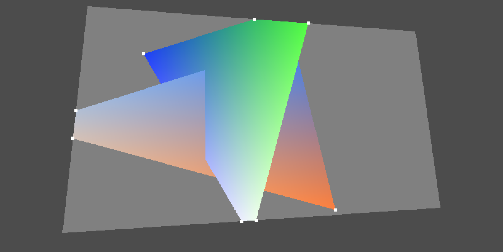

# graphicsUCL--Courseworks

all the files:
1. PathTracer
2. rasterizationDemo
3. RayTracerSimple

Are executable at the website :  http://cg.cs.ucl.ac.uk/ hosted by the University College London

# Results:
## Raytracing

## Rasterization

## Pathtracing

At zero iteration:

At 700 iterations:

